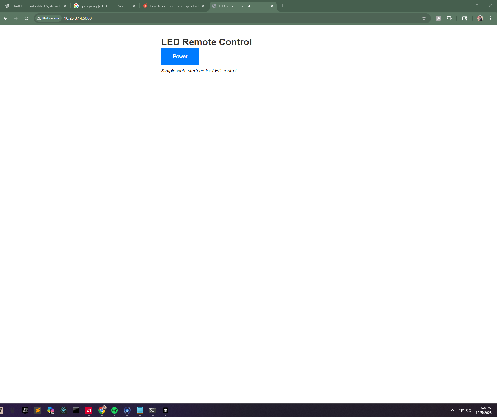
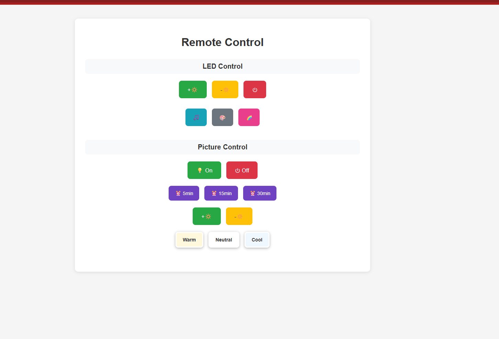

# 9-23

## Prototyping

- First simply connected reciever and transmitter directly to GND, VCC, and GPIO17 & 18
- Got input and output from both, confirming they worked and connected to the code
- Files: IR_Reciever.py and Trans_Brute_Force.py
- Tried to brute force a protocol and reaction by LED from transmitter but it didnt work

## Circut testing

- followed https://www.youtube.com/watch?v=b8OxSebL0SE
- achieved LED lighting up when IR pressed

# 9-24

## IR Receiver circuit
Referenced https://forums.raspberrypi.com/viewtopic.php?t=209958

Did a voltage divider with a 10k Ohm and 5k Ohm resistor, used 5v power and had 3.3 v to the GPIO.
Found out it was an NEC through chat gpt generated script
Then used a chatgpt generated script, point remote at the device, press ctrl-c and it recorded.
- Did this manually for all things on both remotes

### Codes:
RGB
power: addr=0x00 cmd=0x40 code16=0x0040 code32=0x00FF40BF
white: addr=0x00  cmd=0x44  code16=0x0044  code32=0x00FF44BB
blue: addr=0x00  cmd=0x45  code16=0x0045  code32=0x00F45BA
green: addr=0x00  cmd=0x59  code16=0x0059  code32=0x00FF59A6
red: addr=0x00  cmd=0x58  code16=0x0058  code32=0x00FF58A7
bright up: addr=0x00  cmd=0x5C code16=0x005C  code32=0x00FF5CA3
bright down: addr=0x00  cmd=0x5D code16=0x005D  code32=0x00FF5DA2
play: addr=0x00  cmd=0x41 code16=0x0041  code32=0x00FF41BE
orange: addr=0x00  cmd=0x54  code16=0x0054  code32=0x00FF54AB
light green: addr=0x00  cmd=0x55  code16=0x0055  code32=0x00FF55AA
mid-blue: addr=0x00  cmd=0x49  code16=0x0049  code32=0x00FF49B6
red-orange: addr=0x00  cmd=0x50  code16=0x0050  code32=0x00FF50AF
blue-green: addr=0x00  cmd=0x51  code16=0x0051  code32=0x00FF51AE
blue-purple: addr=0x00  cmd=0x4D  code16=0x00$D  code32=0x00FF4DB2
green-yellow: addr=0x00  cmd=0x1C code16=0x001C  code32=0x00FF1CE3
aquamarine: addr=0x00  cmd=0x1D code16=0x001D  code32=0x00FF51DE2
light-purple: addr=0x00  cmd=0x1E code16=0x001E  code32=0x00FF1EE1
yellow: addr=0x00  cmd=0x18  code16=0x0018  code32=0x00FF18E7
green-blue:  addr=0x00  cmd=0x19  code16=0x0019  code32=0x00FF19E6
purple: addr=0x00  cmd=0x1A  code16=0x001A code32=0x00FF1AE5
music1: addr=0x00  cmd=0x48  code16=0x0048 code32=0x00FF48B7
music2: addr=0x00  cmd=0x4C  code16=0x004C code32=0x00FF4CB3
music3: addr=0x00  cmd=0x1F  code16=0x001F code32=0x00FF1FE0
music4: addr=0x00  cmd=0x1B  code16=0x001B  code32=0x00FF1BE4
more-red: addr=0x00  cmd=0x14  code16=0x0014  code32=0x00FF14EB
less-red: addr=0x00  cmd=0x10  code16=0x0010  code32=0x00FF10EF
more-green: addr=0x00  cmd=0x15  code16=0x0015  code32=0x00FF15EA
less-green: addr=0x00  cmd=0x11  code16=0x0011  code32=0x00FF11EE
more-blue: addr=0x00  cmd=0x16  code16=0x0016  code32=0x00FF16E9
less-blue: addr=0x00  cmd=0x12  code16=0x0012  code32=0x00FF12ED
fade: addr=0x00  cmd=0x07  code16=0x0007  code32=0x00FF07F8
slow: addr=0x00  cmd=0x13  code16=0x0013  code32=0x00FF13EC
quick: addr=0x00  cmd=0x0F  code16=0x000F  code32=0x00FF0FF0

Picture Lights
On: addr=0x00  cmd=0x45  code16=0x0045  code32=0x00F45BA
Off: addr=0x00  cmd=0x47  code16=0x0047  code32=0x00FF47B8
Static: addr=0x00  cmd=0x44  code16=0x0044  code32=0x00F44BB
Auto-Day: addr=0x00  cmd=0x40  code16=0x0040  code32=0x00F40BF
Auto-Night: addr=0x00  cmd=0x43  code16=0x0043  code32=0x00F43BC
White: addr=0x00  cmd=0x07  code16=0x0007  code32=0x00FF07F8
Warm: addr=0x00  cmd=0x15  code16=0x0015  code32=0x00FF15EA
Neutral: addr=0x00  cmd=0x09  code16=0x0009  code32=0x00FF09F6
Darker: addr=0x00  cmd=0x16  code16=0x0016  code32=0x00FF16E9
Brighter: addr=0x00  cmd=0x0D  code16=0x000D  code32=0x00FF0DF2
5-min: addr=0x00  cmd=0x0C  code16=0x000C  code32=0x00FF0CF3
15-min: addr=0x00  cmd=0x18  code16=0x0018  code32=0x00FF18E7
30-min: addr=0x00  cmd=0x5E  code16=0x005E  code32=0x00FF5EA1

``` Python
overlapping_cmds = {
    ("white", "static"),
    ("blue", "on"),
    ("fade", "white-light"),
    ("power", "auto_day"),
    ("more-green", "warm"),
    ("more-blue", "darker"),
    ("yellow", "15-min"),
}
```

## IR Transmitter
Used a chatgpt generated script to allow for inputing that address line for quick test
got it to turn on and off the lights

## Next steps
- Research how IR works
- Research the input the sensor takes
- Research how to enhance the signal like remote

## 9-25

### Virtual_Remote.py
- embedded all cmds into a python file, and then marked all overlapping as well as cmds that turn the lights on

Lets imagine we start on ("blue", "white_light") and hit "more-green". 
This then pushes "warm", so we need to hit "white_light". 
This will push to "fade".
So we will end in ("fade", "white_light")

One IR Solution ->
Most will work to be (old_state, old_state) -> (new_state, altered_state) -> (new_state, old_state).
If new_state & old_state overlap **SEPERATE THINGS**, we can't change -> deny it so we dont get out state

Two IR Solution ->
Simply switch one at a time

Realistic Use / Fix
Include only

power: addr=0x00 cmd=0x40 code16=0x0040 code32=0x00FF40BF
white: addr=0x00  cmd=0x44  code16=0x0044  code32=0x00FF44BB
blue: addr=0x00  cmd=0x45  code16=0x0045  code32=0x00F45BA
green: addr=0x00  cmd=0x59  code16=0x0059  code32=0x00FF59A6
red: addr=0x00  cmd=0x58  code16=0x0058  code32=0x00FF58A7
bright up: addr=0x00  cmd=0x5C code16=0x005C  code32=0x00FF5CA3
bright down: addr=0x00  cmd=0x5D code16=0x005D  code32=0x00FF5DA2
orange: addr=0x00  cmd=0x54  code16=0x0054  code32=0x00FF54AB
light green: addr=0x00  cmd=0x55  code16=0x0055  code32=0x00FF55AA
mid-blue: addr=0x00  cmd=0x49  code16=0x0049  code32=0x00FF49B6
red-orange: addr=0x00  cmd=0x50  code16=0x0050  code32=0x00FF50AF
blue-green: addr=0x00  cmd=0x51  code16=0x0051  code32=0x00FF51AE
blue-purple: addr=0x00  cmd=0x4D  code16=0x00$D  code32=0x00FF4DB2
green-yellow: addr=0x00  cmd=0x1C code16=0x001C  code32=0x00FF1CE3
aquamarine: addr=0x00  cmd=0x1D code16=0x001D  code32=0x00FF51DE2
light-purple: addr=0x00  cmd=0x1E code16=0x001E  code32=0x00FF1EE1
yellow: addr=0x00  cmd=0x18  code16=0x0018  code32=0x00FF18E7
green-blue:  addr=0x00  cmd=0x19  code16=0x0019  code32=0x00FF19E6
purple: addr=0x00  cmd=0x1A  code16=0x001A code32=0x00FF1AE5
fade: addr=0x00  cmd=0x07  code16=0x0007  code32=0x00FF07F8
slow: addr=0x00  cmd=0x13  code16=0x0013  code32=0x00FF13EC
quick: addr=0x00  cmd=0x0F  code16=0x000F  code32=0x00FF0FF0

On: addr=0x00  cmd=0x45  code16=0x0045  code32=0x00F45BA
Off: addr=0x00  cmd=0x47  code16=0x0047  code32=0x00FF47B8
Static: addr=0x00  cmd=0x44  code16=0x0044  code32=0x00F44BB
white-light: addr=0x00  cmd=0x07  code16=0x0007  code32=0x00FF07F8
Warm: addr=0x00  cmd=0x15  code16=0x0015  code32=0x00FF15EA
Neutral: addr=0x00  cmd=0x09  code16=0x0009  code32=0x00FF09F6
Darker: addr=0x00  cmd=0x16  code16=0x0016  code32=0x00FF16E9
Brighter: addr=0x00  cmd=0x0D  code16=0x000D  code32=0x00FF0DF2
5-min: addr=0x00  cmd=0x0C  code16=0x000C  code32=0x00FF0CF3
15-min: addr=0x00  cmd=0x18  code16=0x0018  code32=0x00FF18E7
30-min: addr=0x00  cmd=0x5E  code16=0x005E  code32=0x00FF5EA1

("white", "static"),
("blue", "on"),
("fade", "white-light"),
("power", "auto_day"),
("more-green", "warm"),
("more-blue", "darker"),
("yellow", "15-min"),

## 10/6

Created Web Dashboard for WEB Remote
Designed specifically for 8 in display screen / quick web
changed IR Virtual_remote into a class we can instatiate with a GPIO Pin 
Plan to allow both, or 1, or custom control type with address map





added state to remote, remote class sends cmd. kept code if we want same transmitter.